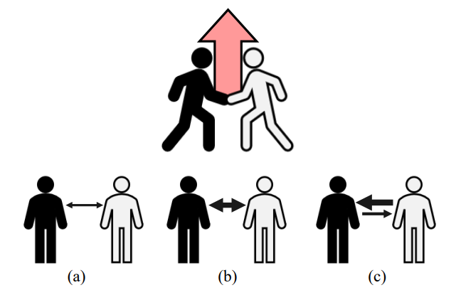

# Understanding Interaction Synergistic Effect   with Graph Structural Approach
## Abstract
In the current era of big data, large amounts of data are being generated in various domains.
Moreover, synergistic effects occur in each domain.
Synergistic effect occurs when more than individual work is achieved, and synergies that interact with each other may differ.

This study aims to understand synergy by measuring synergies that interact based on individual competences.
Existing measurement methods looked at synergy symmetrically by measuring it dichotomously or intensity.
This measurement method cannot measure asymmetric synergistic effects.
Therefore, this study proposes a method to measure the different synergistic effects given and received when there are different competences between actors, utilizing information on movies screened in Korea.
This also allows for the synergy received by new actors to be measured differently depending on the box office of the movies in which they appeared.

<figure>
  

    
    <figcaption align = "center"><b>Fig.1 : Synergy measurement criteria. (a) Binary of synergy (b) Intensity of synergy (c) Asymmetry of synergy</b></figcaption>
  

</figure>

## Dataset
- Data Source : [KOBIS](https://www.kobis.or.kr)
- *daily.csv* : Daily box office data (2003.11/11~2021.07/07)
- *movie.csv* : Detailed data of movies in the *daily.csv*
